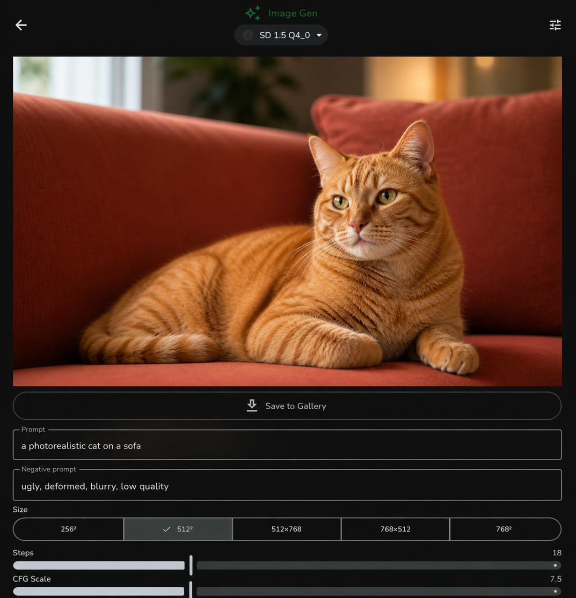

[](https://kotlinlang.org)
[](https://developer.android.com)
[](https://github.com/jegly/Box/releases)
[](LICENSE)
[](https://github.com/ggerganov/llama.cpp)
[](https://github.com/leejet/stable-diffusion.cpp)
[](https://github.com/ggerganov/whisper.cpp)
[]()
[](https://ai.google.dev/edge/litert)
[]()
[]()
[](https://www.qualcomm.com/products/mobile/snapdragon)
[-FF79C6.svg)](https://store.google.com/gb/category/phones)
[](https://www.mediatek.com/)
[](https://www.zetetic.net/sqlcipher/)
[]()
[]()
[]()
[]()
[](https://github.com/google-ai-edge/gallery)
[](https://github.com/jegly/Box/releases)


If this project helped you, please ⭐️ star it to help others find it 
## 📱 Download

[](https://github.com/jegly/Box/releases/tag/v1.0.3)


> **Note:** If you're using a custom ROM (LineageOS, GrapheneOS, CalyxOS), please use the [custom-rom-support-v1.0.3 release](https://github.com/jegly/Box/releases/tag/custom-rom-support-v1.0.3) instead.

**Box is a security-hardened fork of [Google AI Edge Gallery](https://github.com/google-ai-edge/gallery) — with on-device image generation, voice mode (speech-to-speech AI chat), voice input, document analysis, vision AI, biometric lock, encrypted chat history, llama.cpp support, and GGUF model import.**


## Disclaimer

Box is an independent community fork of [Google AI Edge Gallery](https://github.com/google-ai-edge/gallery) and is not affiliated with or endorsed by Google LLC. Google branding has been replaced throughout. All credit for the underlying platform goes to Google and the original contributors — this fork simply builds on top of their work.


## Related

Built [OfflineLLM](https://github.com/jegly/OfflineLLM) first — a privacy-first Android chat app with a [llama.cpp](https://github.com/ggerganov/llama.cpp) backend.

This project (`Box`) forks Google's AI Edge Gallery to create a **hybrid LiteRT / llama.cpp** feature rich hybrid experience. 

→ Try the [OfflineLLM app](https://github.com/jegly/OfflineLLM) for pure llama.cpp on-device chat.

---

## What is Box?

Box is an Android app for running AI entirely on-device — chat, voice mode, image generation, speech-to-text, document analysis, and vision, all without a network connection. It inherits the full feature set of the upstream Google AI Edge Gallery and layers on top: encrypted conversations, biometric lock, hard offline mode, and three additional native inference engines (llama.cpp, stable-diffusion.cpp, whisper.cpp) alongside LiteRT.

# Box: On-Device AI. No Cloud. No Compromise.

**What makes Box unique?** You can sit at your desk, tap two buttons, and have a real flowing voice conversation with an AI — no wake word, no account, no server, no subscription. It listens, thinks, and speaks back sentence by sentence before it's even finished generating. Point the camera at something and ask about it out loud. The AI sees it and answers. All of it runs on the phone in your hand, completely offline, faster than you'd expect. 


**I have now created a separate branch called custom-rom-support, along with a corresponding release section specifically for users on third-party operating systems.
If you are using a custom ROM, please use the custom-rom-support
 branch/release instead of the main branch. This branch supports TPU/NPU
 acceleration on Tensor devices; however, Snapdragon acceleration 
remains untested.
Please expect broken features if you are using a custom ROM and running the current release or branch from main. A separate APK and branch (custom-rom-support)
 are now available for users on third-party Android operating systems, 
including but not limited to LineageOS, GrapheneOS, and CalyxOS.
Note:
 The primary reason for these limitations is that third-party operating 
systems typically lack AICore and system-level Text-to-Speech (TTS) 
components. As a result, features such as voice-to-voice mode and 
NPU/GPU acceleration are either unavailable or significantly impaired on
 these ROMs.**

---

## Screenshots

<table>
  <tr>
    <td align="center"><br/><sub>Home</sub></td>
    <td align="center"><br/><sub>AI Chat</sub></td>
    <td align="center"><br/><sub>Multimodal Input</sub></td>
  </tr>
  <tr>
    <td align="center"><br/><sub>Vision AI</sub></td>
    <td align="center"><br/><sub>Voice Input</sub></td>
    <td align="center"><br/><sub>Audio Scribe</sub></td>
  </tr>
  <tr>
    <td align="center"><br/><sub>Whisper STT</sub></td>
    <td align="center"><br/><sub>LiteRT Voice Backend</sub></td>
    <td align="center"><br/><sub>Image Generation</sub></td>
  </tr>
  <tr>
    <td align="center"><br/><sub>Diffusion Output</sub></td>
    <td align="center"><br/><sub>Photo Generation of a Orange brain cell</sub></td>
    <td align="center"><br/><sub>Mobile Actions</sub></td>
  </tr>
  <tr>
    <td align="center"><br/><sub>Agent Skills</sub></td>
    <td align="center"><br/><sub>Prompt Lab</sub></td>
    <td align="center"><br/><sub>Model Config</sub></td>
  </tr>
  <tr>
    <td align="center"><br/><sub>Model Select</sub></td>
    <td align="center"><br/><sub>Settings</sub></td>
    <td></td>
  </tr>
</table>

---

## What Box adds on top of upstream

Box is a fork of [Google AI Edge Gallery](https://github.com/google-ai-edge/gallery). The upstream project is excellent — Box just layers on additional capabilities:

| Area | What Box adds |
|---|---|
| Inference engines | llama.cpp (GGUF LLMs), stable-diffusion.cpp (image gen), whisper.cpp (STT) alongside LiteRT |
| Model import | Import any local GGUF file — not limited to the curated download list |
| NPU / TPU | All Snapdragon / Tensor / MediaTek variants bundled in one APK (upstream ships per-SoC) |
| Voice mode / Vision mode| Free talk (continuous hands-free loop) and Vision talk (live camera + voice) |
| Image generation | On-device Stable Diffusion via GGUF |
| Speech-to-text | On-device Whisper STT |
| Document analysis | Attach text files directly in chat |
| Chat history | Persisted to a SQLCipher-encrypted Room database, resumable across sessions |
| Security | Biometric app lock, hard offline mode, prompt sanitisation, audit log |
| Agent skills | 20 built-in skills (upstream has 9) |
| Math rendering | LaTeX expressions rendered as Unicode in chat |

---

## Core Features

### Local Chat
Multi-turn conversations with on-device LLMs. Import any GGUF model or download LiteRT models from the built-in list. Supports Thinking Mode on compatible models. Full markdown rendering with LaTeX math support — Greek letters, operators, fractions, and notation are rendered as Unicode symbols. Conversations are persisted and resumable.

> **Recommended models:** We highly recommend **Gemma 4 E2B** or **Gemma 4 E4B** (LiteRT) as your primary models — best-tested, support vision, voice, and documents, and run efficiently with GPU/NPU acceleration. Available to download directly in the app.

With **Gemma 4 E2B / E4B** selected, the chat input expands to a full multimodal interface:
- 📎 Attach documents (`.txt`, `.md`, `.csv`, `.json`, `.py`, `.kt`, and more) — content is injected into context automatically
- 🎙 Record an audio clip or pick a WAV file to speak your question
- 📷 Take a photo or pick from album for visual Q&A

### Local Diffusion
On-device image generation powered by [stable-diffusion.cpp](https://github.com/leejet/stable-diffusion.cpp). Runs Stable Diffusion 1.5 in GGUF format fully offline — no API key, no cloud. Configurable steps, CFG scale, seed, and image size presets. Save generated images directly to your gallery. Import your own GGUF diffusion models.

### Voice Input
On-device speech-to-text using [whisper.cpp](https://github.com/ggerganov/whisper.cpp). Tap to record, tap to transcribe. Copy or clear results. Supports Whisper Tiny through Small models in multiple languages. Audio never leaves the device.

### Free Talk — Real-Time Voice Conversation

Tap the mic and the speaker. That's it. Box listens to you, sends your words to the AI, and speaks the reply back — then immediately starts listening again. No tapping between turns. No waiting for a full response before it starts speaking. Just sit there and talk to it like a person.

On Gemma 4 E2B it keeps up in real time. The first sentence of the reply is already being spoken while the model is still generating the rest.

- *"Explain quantum entanglement like I'm five"* → speaks the answer, listens for your follow-up
- *"Actually, go deeper on that last point"* → multi-turn, completely hands-free  
- *"Help me think through a problem I'm having at work"* → back and forth, no typing ever
- *"What should I cook for dinner tonight? I've got chicken and not much else"* → practical daily use

It feels like having an AI sitting across from you. Entirely offline. Nothing leaves the device.

Three toggles in AI Chat control it:
- **🎤 Mic** — tap once to enter free talk mode, tap again to stop
- **🔊 Speaker** — AI replies spoken aloud, sentence by sentence as they generate
- **📹 Camera** — live vision mode (see below)

Enable **Real-time voice reply** in Settings for sentence-by-sentence speech as the model generates. Works out of the box with Android's built-in speech and TTS — load a Whisper or Piper model for higher quality.

> **De-Googled ROMs (GrapheneOS, CalyxOS, LineageOS without GApps):** Google TTS is not pre-installed on these devices. Install a TTS engine from F-Droid (e.g. [RHVoice](https://f-droid.org/packages/com.github.olga_yakovleva.rhvoice.android/) or [eSpeak NG](https://f-droid.org/packages/com.reecedunn.espeak/)) and set it as your default in **Android Settings → Accessibility → Text-to-speech**. The app will use it automatically.

---

### Vision Talk — Live Camera + Voice AI

Tap the camera toggle to stream your back camera directly to the AI. Point it at anything and ask — the AI sees the current frame alongside your question and speaks its answer back. All offline, no cloud.

**Things you can do:**

- Point at a plant → *"What species is this and how do I care for it?"*
- Point at food in your fridge → *"What can I cook with what's here?"*
- Point at a label or sign in another language → *"What does this say?"*
- Point at a circuit board → *"What component is this and what does it do?"*
- Point at your code on a laptop screen → *"What's wrong with this function?"*
- Point at a meal → *"Roughly how many calories is this?"*
- Point at a maths problem → *"Walk me through how to solve this"*

Combine with mic + speaker for a fully hands-free vision conversation — speak your question, AI sees the scene, speaks the answer, listens for the next question. Requires a vision-capable model (Gemma 4 E2B or E4B).

When mic is off, camera mode sends a frame every 3 seconds automatically with "What do you see?" — useful for passive scene description.

### Vision AI
Ask questions about images using on-device vision models. Powered by LiteRT with Gemma 4 E2B / E4B — GPU-accelerated, up to 32K context.

### Biometric App Lock
Enable an optional biometric lock from Settings. The app re-locks automatically every time it is backgrounded. Unlock via fingerprint or face authentication before any content is shown.

### Encrypted Chat History
All conversations are stored in a SQLCipher-encrypted Room database. History persists across sessions and is resumable from the Chat History screen. Swipe to delete individual conversations, or wipe all at once.

### NPU / TPU Acceleration
All Qualcomm Hexagon NPU variants (Snapdragon 8 Gen 2 / 8 Gen 3 / 8 Elite / newer), Google Tensor TPU (Pixel 8–10), and MediaTek NPU are bundled in a single APK — no separate builds per device. Select **NPU/TPU** in the model's accelerator dropdown; Box auto-detects the chip and loads the right runtime. Uses LiteRT JIT compilation on-device, so no pre-compiled model files are needed.

Supported hardware:
- **Snapdragon 8 Gen 2** (SM8550, Hexagon V69)
- **Snapdragon 8 Gen 3** (SM8650, Hexagon V73)
- **Snapdragon 8 Elite** (SM8750, Hexagon V75)
- **Snapdragon 8 Elite for Galaxy** (SM8850, Hexagon V79)
- **Snapdragon next-gen** (Hexagon V81)
- **Google Tensor G3 / G4 / G5** (Pixel 8 / 9 / 10)
- **MediaTek Dimensity** (MT6989, MT6991)

### GGUF Model Import
Import any GGUF model file from local storage. At import time set the display name and choose the accelerator (CPU, GPU via OpenCL/Vulkan, or NPU via QNN delegate). Stable Diffusion GGUF models can also be imported for image generation.

### Hard Offline Mode
A toggle in Settings forces the app into a fully airgapped state — all download attempts throw an exception and no network calls are made.

---

## Getting Started

### Requirements

- Android 16+
- ~4 GB of free storage for a typical quantised LLM

### Build from source

```bash
git clone --recurse-submodules https://github.com/jegly/box
cd box/Android
./gradlew :app:assembleDebug
```

The `--recurse-submodules` flag is required to pull llama.cpp, stable-diffusion.cpp, and whisper.cpp submodules. The first build compiles all three native libraries from source — expect 15–25 minutes. Subsequent builds are fast.

Open `Android/` in Android Studio (Ladybug or newer) and run on a physical device for best performance.

### Loading a GGUF model ( Use LiteRT for speed & performance ) 

1. Copy a `.gguf` file to your device (Downloads, USB, etc.)
2. Open the app → **Model Manager** in the drawer
3. Tap **Import** and pick your file
4. Set a display name and choose CPU / GPU / NPU
5. The model appears in AI Chat

---

## Security Architecture

| Mechanism | Details |
|---|---|
| Database encryption | SQLCipher via `androidx.room` — AES-256 at rest |
| Biometric gate | `BiometricPrompt` API, re-prompts on each foreground |
| Offline mode | `OfflineMode` singleton blocks `DownloadWorker` and network calls |
| Prompt sanitisation | `SecurityUtils.sanitizePrompt()` strips control characters before inference and persistence |
| Tapjacking protection | `filterTouchesWhenObscured` set on the chat scaffold |
| Audit log | `SecurityAuditLog` writes security events to a local append-only log |

---

## Technology Stack

- **Kotlin + Jetpack Compose** — UI
- **Hilt** — dependency injection
- **Room + SQLCipher** — encrypted persistence
- **LiteRT-LM** — LiteRT inference runtime for LLMs (GPU + NPU/TPU)
- **Qualcomm QNN / QAIRT 2.41** — Hexagon NPU runtime (V69–V81, bundled)
- **LiteRT NPU dispatch** — auto-selects Qualcomm / Google Tensor / MediaTek at runtime
- **llama.cpp** — GGUF LLM inference (git submodule)
- **stable-diffusion.cpp** — GGUF image generation (git submodule)
- **whisper.cpp** — on-device speech-to-text (git submodule)
- **Firebase Analytics** — anonymous usage stats (disabled in Offline Mode)

---

## Acknowledgements

Box would not exist without the work of the teams and individuals behind the projects it builds on.

**[Google AI Edge Gallery](https://github.com/google-ai-edge/gallery)** — the upstream project this fork is based on. The Google AI Edge team built an exceptionally well-structured, open-source Android app and made it available under the Apache 2.0 licence. Everything in Box starts from their foundation. Upstream changes are periodically merged and any improvements we make that are appropriate to contribute back will be.

**[llama.cpp](https://github.com/ggerganov/llama.cpp)** — Georgi Gerganov and the llama.cpp contributors for making high-performance on-device LLM inference accessible to everyone.

**[stable-diffusion.cpp](https://github.com/leejet/stable-diffusion.cpp)** — leejet and contributors for the C++ Stable Diffusion implementation that powers on-device image generation.

**[whisper.cpp](https://github.com/ggerganov/whisper.cpp)** — Georgi Gerganov and contributors for the Whisper speech-to-text port.

**[LiteRT / TensorFlow Lite](https://ai.google.dev/edge/litert)** — the Google teams behind LiteRT (formerly TFLite) and the NPU/GPU delegate infrastructure.


Thanks to **aryoda** for consistently reporting valid bugs. Appreciate the reports !


Thank you to everyone who has opened issues, tested builds, or contributed to any of these projects. On-device AI is a community effort.

---

## License

Licensed under the Apache License, Version 2.0

---

## Links

- [Box repository](https://github.com/jegly/box)
- [Upstream: google-ai-edge/gallery](https://github.com/google-ai-edge/gallery)
- [llama.cpp](https://github.com/ggml-org/llama.cpp)
- [stable-diffusion.cpp](https://github.com/leejet/stable-diffusion.cpp)
- [whisper.cpp](https://github.com/ggerganov/whisper.cpp)
- [LiteRT-LM](https://github.com/google-ai-edge/LiteRT-LM)
- [LiteRT NPU docs](https://ai.google.dev/edge/litert/next/litert_lm_npu)
- [Qualcomm QAIRT SDK](https://softwarecenter.qualcomm.com)
- [Hugging Face LiteRT Community](https://huggingface.co/litert-community)
